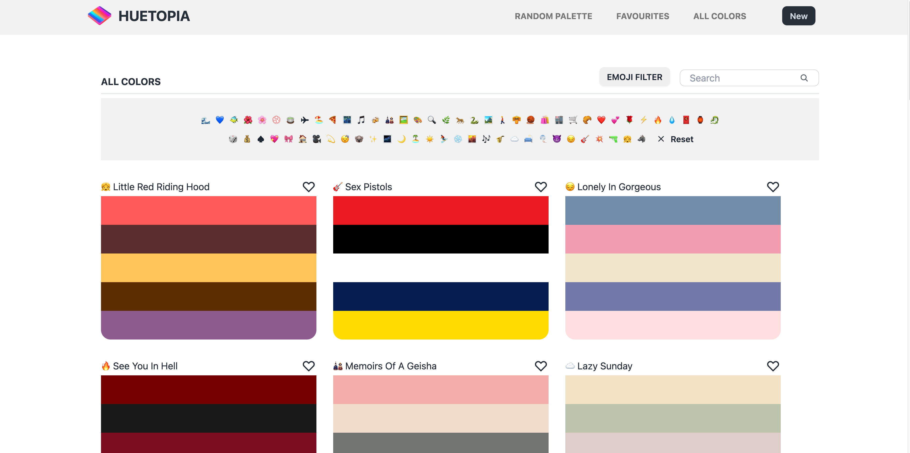

# Huetopia

## Description

Huetopia, a React-powered web-app crafted during our Ironhack Web Development Bootcamp, unlocks the power of color. Harnessing advanced AI, it transforms your words into vibrant color palettes. Unleash your imagination with Huetopia! Explore the codebase on GitHub.

## How it works

Use your imagination to give the AI an input and you will get a color palette inspired by your words in return.
 
Add the ones you like to your favourites and feel free to edit the names of the palettes in your Favourites list, while they remain the same in the All Colors page.
 
If you’re not inspired, click on Random Palette to get one from our collection.
 
The emoji filter will help you find new color palettes whenever you can’t express your thoughts in words.

# Demo

Try [Huetopia](https://huetopia.netlify.app/) yourself!
